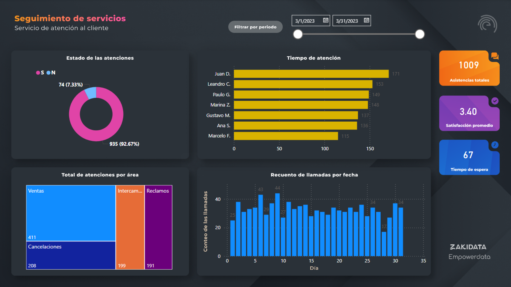

# ENGLISH

# Call Center Efficiency Dashboard

## 📌 Project Overview

This project is a **Power BI dashboard** designed to monitor and improve call center operations. It allows analysis of key metrics, identification of improvement opportunities, and supports data-driven decision-making.

The dashboard tracks:
- Total calls answered.
- Average handling time per call.
- Calls by date.
- Calls by area: Sales, Complaints, Cancellations & Exchanges.
- Average waiting time for customers.
- Operational efficiency per area.

---

## 🛠️ Tools & Technologies
- **Power BI**: Dashboard and interactive visualizations  
- **Excel**: Source data  
- **Data Analysis**: KPIs calculation, aggregations, and trend analysis  

---

## 📷 Vista Previa del Dashboard

---

## 📂 Repository Structure
/CallCenter_Efficiency_Dashboard
/dashboard # Power BI file (.pbix)
/images # Screenshots for README
/data # Project dataset
README.md # Project documentation

---

## 🚀 How to Explore
1. Open the Power BI file (`.pbix`) in Power BI Desktop.  
2. Interact with the visualizations to explore metrics and trends.  
3. Analyze operational efficiency per area and agent, and review handling and waiting times.  

---

## 📌 Next Steps
- Integration with real-time data sources  
- Include predictive analytics to forecast call volume and waiting times  
- Expand KPIs to evaluate individual agent performance and customer satisfaction  

---

✨ **Author:** Lexa Pérez  
📧 Contact: lexaperez24@gmail.com  
🔗 GitHub: [https://github.com/lexaperez24/CallCenter_Efficiency_Dashboard](https://github.com/lexaperez24/CallCenter_Efficiency_Dashboard)

---

# ESPAÑOL

# Dashboard de Eficiencia de Call Center

## 📌 Descripción del Proyecto

Este proyecto consiste en un **dashboard de Power BI** diseñado para monitorear y mejorar las operaciones de un call center. Permite analizar métricas clave, identificar oportunidades de mejora y apoyar la toma de decisiones basada en datos.

El dashboard muestra información sobre:
- Número total de llamadas atendidas.
- Tiempo promedio de atención por llamada.
- Llamadas por fecha.
- Distribución de llamadas por área: Ventas, Reclamos, Cancelaciones e Intercambios.
- Tiempo de espera promedio de los clientes.
- Eficiencia general por área.

---

## 🛠️ Herramientas y Tecnologías
- **Power BI**: Creación del dashboard y visualizaciones interactivas.
- **Excel**: Fuente de datos.
- **Análisis de datos**:  Cálculo de KPIs, agregaciones y tendencias.

--- 

## 📷 Vista Previa del Dashboard

---

## 📂 Estructura del Repositorio
/CallCenter_Efficiency_Dashboard
/dashboard # Archivo Power BI (.pbix)
/images # Capturas de pantalla para README
/data # Datos del proyecto
README.md # Documentación del proyecto

---

## 🚀 Cómo Explorar el Dashboard

1. Abre el archivo Power BI (`.pbix`) en Power BI Desktop.
2. Interactúa con las visualizaciones para explorar métricas y tendencias.
3. Analiza la eficiencia por área y por agente, y revisa los tiempos de atención y espera.

---

## 📌 Próximos Pasos
- Integración con fuentes de datos en tiempo real.
- Inclusión de análisis predictivo para anticipar volumen de llamadas y tiempos de espera.
- Expansión de KPIs para evaluar desempeño individual de agentes y satisfacción del cliente.

--- 

✨ **Autor**: Lexa Pérez  
📧 Contacto: lexaperez24@gmail.com  
🔗 GitHub: [https://github.com/lexaperez24/CallCenter_Efficiency_Dashboard](https://github.com/lexaperez24/CallCenter_Efficiency_Dashboard)